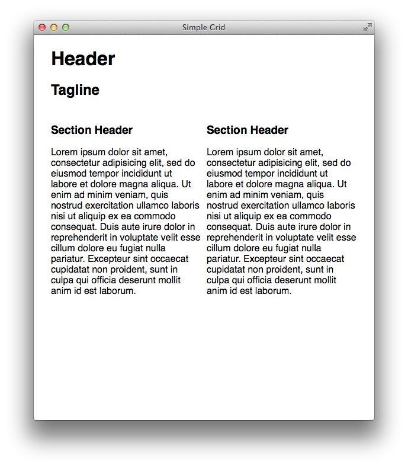

Simple Grid
===========

A simple, responsive CSS grid layout. A nice starting point for getting a
responsive site up and running quickly without too much boilerplate.

# Usage

Simple grid is meant to be easy to read and use - the code for the grid system
is a mere 87 lines. The grid uses a width of 90% that maxes out at 1000 pixels
and will scale correctly with a single media query for mobile.

Simple grid is a twelve column grid system and includes the following classes:

* **.container**
* **.clearfix**
* **.grid_n** (1-12)
* **.alpha**
* **.omega**

That's it.

### Example

```html
<article class="container clearfix">

  <!-- full width header -->
  <header class="grid_12">
    <h1>Header</h1>
    <h2>Tagline</h2>
  </header>

  <!-- 50/50 split content -->
  <section class="grid_6 alpha">
    <h3>Section Header</h3>
    <p>
      Lorem ipsum dolor sit amet, consectetur adipisicing elit, sed do eiusmod
      tempor incididunt ut labore et dolore magna aliqua. Ut enim ad minim
      veniam, quis nostrud exercitation ullamco laboris nisi ut aliquip ex ea
      commodo consequat. Duis aute irure dolor in reprehenderit in voluptate
      velit esse cillum dolore eu fugiat nulla pariatur. Excepteur sint occaecat
      cupidatat non proident, sunt in culpa qui officia deserunt mollit anim id
      est laborum.
    </p>
  </section>
  <section class="grid_6 omega">
    <h3>Section Header</h3>
    <p>
      Lorem ipsum dolor sit amet, consectetur adipisicing elit, sed do eiusmod
      tempor incididunt ut labore et dolore magna aliqua. Ut enim ad minim
      veniam, quis nostrud exercitation ullamco laboris nisi ut aliquip ex ea
      commodo consequat. Duis aute irure dolor in reprehenderit in voluptate
      velit esse cillum dolore eu fugiat nulla pariatur. Excepteur sint occaecat
      cupidatat non proident, sunt in culpa qui officia deserunt mollit anim id
      est laborum.
    </p>
  </section>

</article>
```

Result




# What's Included

This repository includes all you need to build your own site styles. This
includes:

1. Normalize.css
1. style.css (for your styles)
1. Myth CSS Processing
1. CSS-Clean Minification

If you would prefer to exclude normalize, simply remove it from the `SRC`
variable in the Makefile. Include additional stylesheets by adding them to the
`src` directory and adding them to the `SRC` variable in the Makefile.

*Because simple grid is built using myth, you may use CSS features without
prefixes.*

# Building

Install the dependencies then run the make task.

    $ npm install
    ...
    $ make
    ===========================
    dist/style.css written
    dist/style.min.css written
    ===========================

# License

The MIT License (MIT)

Copyright (c) 2014 Matt Hernandez

Permission is hereby granted, free of charge, to any person obtaining a copy of
this software and associated documentation files (the "Software"), to deal in
the Software without restriction, including without limitation the rights to
use, copy, modify, merge, publish, distribute, sublicense, and/or sell copies of
the Software, and to permit persons to whom the Software is furnished to do so,
subject to the following conditions:

The above copyright notice and this permission notice shall be included in all
copies or substantial portions of the Software.

THE SOFTWARE IS PROVIDED "AS IS", WITHOUT WARRANTY OF ANY KIND, EXPRESS OR
IMPLIED, INCLUDING BUT NOT LIMITED TO THE WARRANTIES OF MERCHANTABILITY, FITNESS
FOR A PARTICULAR PURPOSE AND NONINFRINGEMENT. IN NO EVENT SHALL THE AUTHORS OR
COPYRIGHT HOLDERS BE LIABLE FOR ANY CLAIM, DAMAGES OR OTHER LIABILITY, WHETHER
IN AN ACTION OF CONTRACT, TORT OR OTHERWISE, ARISING FROM, OUT OF OR IN
CONNECTION WITH THE SOFTWARE OR THE USE OR OTHER DEALINGS IN THE SOFTWARE.
